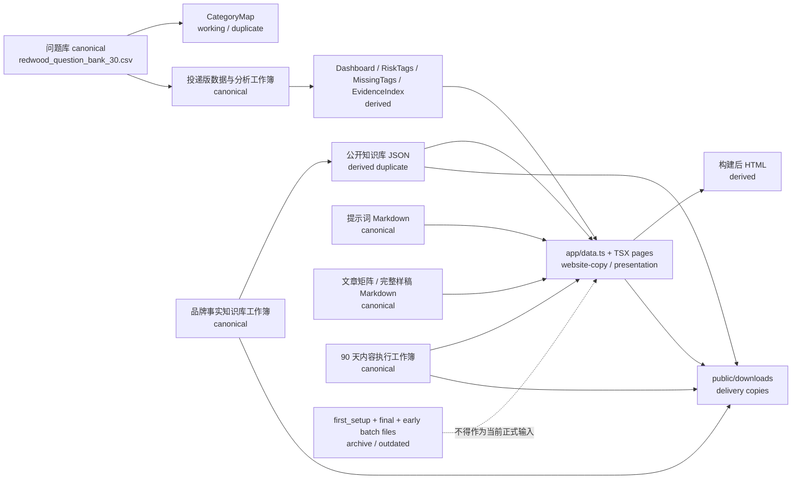

# 元亨利 GEO 作品集｜数据源主从关系图

阶段：0.3B 确认并锁定唯一可信数据源
审计日期：2026-07-19
范围：记录已确认关系、待确认关系和归档关系；本阶段不修改任何外部数据文件。

## 1. 当前治理结论

当前项目采用外部主源加网站展示副本的静态交付模式。网站仓库不是事实数据库，`app/data.ts` 不是任何核心数据的 canonical。

## 2. 已确认关系

### 2.1 原始回答、人工评分和核心指标

| 角色 | 文件或位置 |
|---|---|
| canonical | `/Users/lay/Documents/New project/outputs/yhl_geo_portfolio_delivery/元亨利GEO_投递版数据与分析.xlsx` |
| derived | 工作簿 `Dashboard`、`RiskTags`、`MissingTags`、`EvidenceIndex`、平台汇总和图表文件 |
| website-copy | `app/data.ts`、首页、方法页、诊断页等 TSX 展示数据 |
| delivery | `public/downloads` 中面向交付的下载副本 |
| archive / outdated | batch1、old10、first_setup、final 早期文件 |

确认关系：

- 原始回答、人工评分、风险标签、缺失标签和核心指标以投递版数据与分析工作簿为准。
- 网站展示指标必须由主工作簿重算或导出后同步。
- `app/data.ts` 只保留展示副本角色。

### 2.2 问题库

| 角色 | 文件或位置 |
|---|---|
| canonical | `/Users/lay/Documents/New project/redwood_geo/data/redwood_question_bank_30.csv` |
| working / duplicate | 投递版数据与分析工作簿 `CategoryMap` |
| derived | 分类汇总、网站分类展示、图表数据 |
| archive / outdated | 早期问题模板、复测模板和 first_setup/final 副本 |

确认关系：

- CSV 与 `CategoryMap` 均为 30 条。
- `question_id` 完全一致。
- 问题文本完全一致。
- 分类字段存在粒度差异：CSV 是细分类，`CategoryMap` 是作品集展示分组。
- 按本阶段判断规则，CSV 确认为问题库 canonical，`CategoryMap` 标记为 working / duplicate。

### 2.3 品牌事实、信源和 FAQ

| 角色 | 文件或位置 |
|---|---|
| canonical | `/Users/lay/Documents/New project/outputs/yhl_geo_portfolio_delivery/knowledge_base/元亨利GEO品牌事实知识库.xlsx` |
| derived | 公开知识库 JSON |
| website-copy | `app/data.ts` 中的品牌事实、FAQ、来源子集和相关 TSX 文案 |
| delivery | `public/downloads/yhl-geo-brand-fact-knowledge-base.xlsx`、`public/downloads/yhl-geo-knowledge-base-public.json` |

确认关系：

- 品牌事实、信源和 FAQ 映射以品牌事实知识库工作簿为准。
- 当前四份公开知识库 JSON 内容一致，但均为公开快照副本，不标记 canonical。
- FAQ 的网站展示文案仍需在主源更新后人工审核同步。

### 2.4 提示词体系和 GEO 文章样稿

| 内容 | Markdown canonical | TSX website-copy / presentation | 构建产物 |
|---|---|---|---|
| 企业提示词体系 | `public/downloads/yhl-geo-enterprise-prompt-system.md` | `app/prompt-system/page.tsx` | derived HTML |
| GEO 文章矩阵 | `public/downloads/yhl-geo-article-matrix.md` | `app/geo-articles/page.tsx` | derived HTML |
| GEO 完整文章样稿 | `public/downloads/yhl-geo-full-article-samples.md` | `app/geo-articles/page.tsx` | derived HTML |

确认关系：

- Markdown 文件为当前内容 canonical。
- TSX 页面为 website-copy / presentation。
- 本次检查未发现只有 TSX、没有 Markdown 的提示词或 GEO 文章项。

### 2.5 90 天策略计划

| 角色 | 文件或位置 |
|---|---|
| canonical | `/Users/lay/Documents/New project/outputs/yhl_geo_portfolio_delivery/strategy/元亨利红木家具GEO_90天内容执行工作簿.xlsx` |
| website-copy | 网站策略页面、`app/data.ts` 中的路线图和内容资产摘要 |
| delivery / derived | PDF、DOCX、截图、渲染预览、下载副本 |

确认关系：

- 90 天执行计划以策略工作簿为准。
- 网站策略页面不作为策略主源。
- PDF 或截图只作为交付或派生展示文件。

## 3. 待确认关系

以下关系仍需人工确认或在后续阶段继续审核：

| 待确认项 | 当前状态 | 原因 |
|---|---|---|
| 原始 AI 回答采集环境 | 需要人工确认 | 历史模型、联网状态、产品端环境需要人工记录边界 |
| 人工评分和风险标签调整 | 需要人工确认 | 评分、幻觉、风险和缺失标签不能由网站反推 |
| FAQ 最终发布文案 | 需要人工审核 | 工作簿有映射，网站有展示文案，发布口径需人工审核 |
| 提示词和文章正式发布口径 | 需要人工审核 | Markdown 已为当前 canonical，但公开发布前仍需人工确认表达边界 |
| 从 final 或 first_setup 迁移内容 | decision-pending | 必须明确人工确认后才能迁移 |
| 未来 CSV 与 CategoryMap 出现 ID 或文本差异 | decision-pending | 一旦冲突，暂停 canonical 决策并输出完整差异 |

## 4. 归档关系

### first_setup

目录：`/Users/lay/Documents/New project/outputs/yhl_geo_first_setup_20260718`

统一标记为 archive。

不得作为以下内容的数据来源：

- 当前问题库
- 当前品牌事实
- 当前指标
- 当前网站展示
- 当前 GEO Skill 正式输入

### final 早期版本

目录：`/Users/lay/Documents/New project/outputs/yhl_geo_portfolio_final`

统一标记为 archive。

只有经过明确人工确认的内容，才能迁移到当前 delivery 体系。

### 早期测试文件

batch1、old10、早期汇总 CSV、早期复测模板和检查快照统一按 archive 或 outdated 处理。它们可以用于历史追溯，但不得混入当前 225 条记录、30 题问题库、核心指标或网站展示。

## 5. app/data.ts 的正式角色

`/Users/lay/Documents/New project/outputs/yhl_geo_portfolio_delivery/website/app/data.ts` 的正式角色是 website-copy。

它不是以下任何内容的 canonical：

- 原始回答
- 人工评分
- 核心指标
- 问题库
- 品牌事实
- 信源
- FAQ
- 90 天策略计划
- 提示词体系
- GEO 文章样稿

后续如主源更新，应按以下顺序同步：

主源修改
→ 人工审核
→ 导出公开快照
→ 重新计算派生指标
→ 更新网站副本
→ 构建验证
→ 提交版本

## 6. 冲突处理

- canonical 与 website-copy 冲突：以 canonical 为准，网站副本等待同步。
- canonical 与 delivery 冲突：以 canonical 为准，重新导出或复制 delivery。
- canonical 与 derived 冲突：重新计算 derived。
- 问题库 CSV 与 `CategoryMap` 的 `question_id` 或问题文本冲突：标记 decision-pending，等待人工确认。
- 品牌事实工作簿与公开 JSON 冲突：以工作簿为准，重新导出 JSON。
- Markdown canonical 与 TSX 页面冲突：以 Markdown 为准，同步 TSX 展示副本。
- archive 与当前 delivery 体系冲突：archive 不参与裁决。

## 7. 08C 问题库版本关系

| 角色 | 文件或位置 | 状态 |
|---|---|---|
| current canonical | `redwood_geo/data/redwood_question_bank_30.csv` | v1，仍为当前 canonical |
| versioned release candidate | `data/question-bank/redwood_question_bank_v2_rc1.csv` | v2-rc1，未切换 |
| version manifest | `data/question-bank/question_bank_versions.json` | 记录 v1 与 v2-rc1 关系 |
| ID mapping | `docs/08c-question-id-mapping.csv` | 记录 q31 至 q39 与 08B 候选 ID 的映射 |
| exclusion record | `docs/08c-excluded-candidates.csv` | 记录未进入 v2 的候选 |

确认关系：

- v1 仍为当前 canonical。
- v2-rc1 是版本化候选，尚未进入网站、测试或生产流程。
- v2 经过验证和人工最终批准后，才可以切换 canonical。
- 网站不得直接读取 v2-rc1。
- v2-rc1 不得反向覆盖外部 v1 文件。
