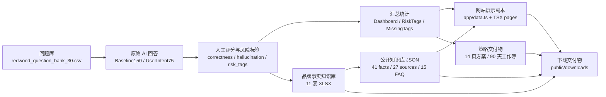

# 元亨利 GEO 作品集｜数据源主从关系图

阶段：0.3 数据源主从关系审计  
审计日期：2026-07-19  
范围：只读检查仓库内数据、下载副本、硬编码网站数据、脚本，以及指定外部目录。审计中额外发现交付目录根部存在一个关键数据工作簿，已只读记录为候选主源。

## 1. 当前数据结构概览

当前项目的数据不是单一数据库，而是一个由工作簿、公开 JSON、网站硬编码副本和下载交付件组成的静态交付链。

核心观察：

- 原始测试、人工评分和大部分可重算指标的最佳候选主源是 `/Users/lay/Documents/New project/outputs/yhl_geo_portfolio_delivery/元亨利GEO_投递版数据与分析.xlsx`。它不在用户列出的六个外部子目录内，但网站和报告反复引用“冻结工作簿原始回答”，且该工作簿包含 `Baseline150`、`UserIntent75`、`RiskTags`、`MissingTags`、`SourceAudit`、`EvidenceIndex` 和 `Dashboard`。
- 品牌事实、信源、FAQ 映射和公开知识库的最佳候选主源是 `/Users/lay/Documents/New project/outputs/yhl_geo_portfolio_delivery/knowledge_base/元亨利GEO品牌事实知识库.xlsx`。
- 网站运行时展示层目前主要依赖 `/Users/lay/Documents/New project/outputs/yhl_geo_portfolio_delivery/website/app/data.ts` 和多个页面中的 TSX 硬编码。
- `public/downloads` 是交付副本目录，部分文件与外部交付主文件逐字节一致，部分 Markdown 的来源尚未确认。

## 2. 每类数据的候选主文件

| 数据类别 | 候选主文件 | 审计状态 |
|---|---|---|
| A. 原始测试数据 | `/Users/lay/Documents/New project/outputs/yhl_geo_portfolio_delivery/元亨利GEO_投递版数据与分析.xlsx` | 最强候选；需人工确认该额外发现文件是否纳入正式外部源范围 |
| A. 问题库 | `/Users/lay/Documents/New project/redwood_geo/data/redwood_question_bank_30.csv` | 候选主源；与工作簿 `CategoryMap` 需确认主从 |
| B. 人工评价数据 | `/Users/lay/Documents/New project/outputs/yhl_geo_portfolio_delivery/元亨利GEO_投递版数据与分析.xlsx` | 最强候选；包含评分、标签、证据笔记和校准表 |
| C. 派生统计数据 | 工作簿 `Dashboard` / `RiskTags` / `MissingTags` | 最强候选；网站图表应从此重算或导出 |
| D. 品牌事实与知识库 | `/Users/lay/Documents/New project/outputs/yhl_geo_portfolio_delivery/knowledge_base/元亨利GEO品牌事实知识库.xlsx` | 明确候选；工作簿说明写明 Excel 是事实主库 |
| D. 公开知识库 JSON | `/Users/lay/Documents/New project/outputs/yhl_geo_portfolio_delivery/knowledge_base/元亨利GEO企业知识库_公开快照.json` | 公开快照候选主源；与 3 个网站副本哈希一致 |
| E. 90 天执行计划 | `/Users/lay/Documents/New project/outputs/yhl_geo_portfolio_delivery/strategy/元亨利红木家具GEO_90天内容执行工作簿.xlsx` | 候选主源 |
| E. 14 页方案 | `/Users/lay/Documents/New project/outputs/yhl_geo_portfolio_delivery/strategy/元亨利红木家具GEO品牌内容优化方案_14页.docx` | 可编辑主源候选；PDF 为渲染副本 |
| F. 网站展示数据 | `/Users/lay/Documents/New project/outputs/yhl_geo_portfolio_delivery/website/app/data.ts` | 展示副本，不建议作为事实主源 |
| F. 文章/提示词页面 | `app/prompt-system/page.tsx`、`app/geo-articles/page.tsx`、`public/downloads/*.md` | 来源未完全确认，需人工定主 |

## 3. 重复文件和副本

已确认的逐字节重复组：

1. 公开知识库 JSON 四处一致：
   - `app/knowledge-base/knowledge-base-public.json`
   - `public/data/yhl-geo-knowledge-base-public.json`
   - `public/downloads/yhl-geo-knowledge-base-public.json`
   - `/Users/lay/Documents/New project/outputs/yhl_geo_portfolio_delivery/knowledge_base/元亨利GEO企业知识库_公开快照.json`

2. 品牌事实知识库 XLSX 两处一致：
   - `public/downloads/yhl-geo-brand-fact-knowledge-base.xlsx`
   - `/Users/lay/Documents/New project/outputs/yhl_geo_portfolio_delivery/knowledge_base/元亨利GEO品牌事实知识库.xlsx`

3. 90 天执行工作簿两处一致：
   - `public/downloads/yhl-geo-90-day-content-execution.xlsx`
   - `/Users/lay/Documents/New project/outputs/yhl_geo_portfolio_delivery/strategy/元亨利红木家具GEO_90天内容执行工作簿.xlsx`

4. 14 页方案 PDF 两处一致：
   - `public/downloads/yhl-geo-brand-content-optimization-plan.pdf`
   - `/Users/lay/Documents/New project/outputs/yhl_geo_portfolio_delivery/strategy/rendered_strategy/元亨利红木家具GEO品牌内容优化方案_14页.pdf`

5. 14 页方案 DOCX 两处一致：
   - `public/downloads/yhl-geo-brand-content-optimization-plan.docx`
   - `/Users/lay/Documents/New project/outputs/yhl_geo_portfolio_delivery/strategy/元亨利红木家具GEO品牌内容优化方案_14页.docx`

6. 工作簿公式错误扫描两处一致：
   - `knowledge_base/previews/formula_errors.ndjson`
   - `strategy/workbook_previews/formula_errors.ndjson`

7. 复测模板两处一致：
   - `/Users/lay/Documents/New project/outputs/yhl_geo_portfolio_final/retest_10_core_template.csv`
   - `/Users/lay/Documents/New project/outputs/yhl_geo_first_setup_20260718/visibility_baseline_template.csv`

相似但非逐字节重复：

- `redwood_question_bank_30.csv` 与 `redwood_question_bank_30.md` 是同一问题库的两种表达。
- `app/geo-articles/page.tsx` 与 `public/downloads/yhl-geo-full-article-samples.md` 内容高度相关，但不是同一文件。
- `app/prompt-system/page.tsx` 与 `public/downloads/yhl-geo-enterprise-prompt-system.md` 内容高度相关，但未发现外部主文件。

## 4. app/data.ts 的数据分别来自哪里

| app/data.ts 数据 | 候选来源 | 来源信心 |
|---|---|---|
| `platformScores` | 投递版数据工作簿 `Dashboard` / `Baseline150.total_score` | 高 |
| `naturalMentionByPlatform` | 投递版数据工作簿 `Dashboard` / `UserIntent75` 非品牌词子样本 | 高 |
| `categoryScoresV2` | 投递版数据工作簿 `CategoryMap` + `Baseline150` 汇总 | 高 |
| `riskAndMissingTags` | 投递版数据工作簿 `RiskTags` 和 `MissingTags` | 高 |
| `hallucinationByDataset` | 投递版数据工作簿 `Dashboard` / `Baseline150` + `UserIntent75` | 高 |
| `sourceCoverageByPlatform` | 投递版数据工作簿 `Dashboard` / `effective_source_flag` | 高 |
| `completionAnswers` | 投递使用说明、5 分钟讲稿、报告摘要、工作簿指标 | 中 |
| `sources` | 知识库工作簿 `信源主表` 的一部分 | 高 |
| `diagnoses` | 投递版数据工作簿 `EvidenceIndex`、报告、知识库事实边界 | 中高 |
| `faq` | 知识库工作簿 `内容FAQ映射` + 人工直接回答文案 | 中高 |
| `factLevels` | 知识库工作簿 `字段字典` / 事实等级 | 高 |
| `contentStrategyAssets` | 90 天执行工作簿 `页面规格` / `内容总矩阵` | 高 |
| `roadmap90` | 90 天执行工作簿 `90天排期` / 策略方案 | 高 |
| download arrays | `public/downloads` 中的下载副本 | 高 |
| `nav` | 网站结构人工配置 | 中 |

## 5. public/downloads 中每个下载文件来自哪里

| 下载文件 | 候选来源 | 关系 |
|---|---|---|
| `yhl-geo-brand-fact-knowledge-base.xlsx` | `knowledge_base/元亨利GEO品牌事实知识库.xlsx` | 逐字节副本 |
| `yhl-geo-knowledge-base-public.json` | `knowledge_base/元亨利GEO企业知识库_公开快照.json` | 逐字节副本 |
| `yhl-geo-90-day-content-execution.xlsx` | `strategy/元亨利红木家具GEO_90天内容执行工作簿.xlsx` | 逐字节副本 |
| `yhl-geo-brand-content-optimization-plan.pdf` | `strategy/rendered_strategy/元亨利红木家具GEO品牌内容优化方案_14页.pdf` | 逐字节副本 |
| `yhl-geo-brand-content-optimization-plan.docx` | `strategy/元亨利红木家具GEO品牌内容优化方案_14页.docx` | 逐字节副本 |
| `yhl-geo-enterprise-prompt-system.md` | 知识库 JSON + `app/prompt-system/page.tsx` 相关内容 | 来源不明，需定主 |
| `yhl-geo-article-matrix.md` | 知识库 JSON + 文章规划 | 来源不明，需定主 |
| `yhl-geo-full-article-samples.md` | `app/geo-articles/page.tsx` 相关内容 | 来源不明，需定主 |

## 6. 哪些指标可以从原始数据重新计算

可从投递版数据工作簿重算：

- Baseline150 平均总分和各平台平均分。
- UserIntent75 平均总分和各平台平均分。
- 品牌识别、实体准确、属性覆盖、可靠性均分。
- 确认错误率、确认幻觉率、疑似幻觉率。
- 有效来源覆盖率。
- 非品牌词自然提及率。
- q01-q28 五类问题互斥分类均分。
- `RiskTags` 和 `MissingTags` 的高频风险/缺失标签计数。
- 12 条证据卡对应的 source row、score、risk tag 和 evidence note。

需要注意：`redwood_geo/data/geo_225_scored_platform_summary.csv` 只有一位小数，不能替代网站中两位小数的精确来源。

## 7. 哪些内容只能依赖人工确认

必须人工确认或复核的内容：

- 原始 AI 回答是否确为当时产品端输出，以及历史联网状态、模型模式缺失时如何标注。
- `correctness`、`hallucination`、`risk_tags`、`missing_info`、`evidence_note` 等人工评分/判断字段。
- 事实等级 L1-L4、信源可用状态、事实边界和允许表述。
- FAQ 的直接回答、边界文案和相关页面归属。
- 14 页方案、提示词体系、文章样稿中的策略性表达和公开声明。
- 第一阶段 `first_setup` 目录中的 FAQ/schema 输入是否仍可用。

## 8. 哪些文件目前无法确认来源

当前来源不明或主从未定：

- `public/downloads/yhl-geo-enterprise-prompt-system.md`
- `public/downloads/yhl-geo-article-matrix.md`
- `public/downloads/yhl-geo-full-article-samples.md`
- `app/prompt-system/page.tsx` 中的 `promptModules`、`blockedClaims`、`answerTemplates`
- `app/geo-articles/page.tsx` 中的 `mainArticle` 和 `articles`
- `app/data.ts` 中的 `completionAnswers` 最终文案口径
- `app/data.ts` 中的 `nav` 和部分页面状态/标签
- `yhl_geo_first_setup_20260718/faq_pairs.json` 与当前 `app/data.ts` FAQ 的关系
- `yhl_geo_first_setup_20260718` 中 schema JSON/HTML 与当前网站 SEO 文件的关系

## 9. 数据更新后网站应如何同步

建议同步顺序：

1. 先更新候选主文件，不直接改网站副本。
2. 原始测试或评分变化：更新投递版数据工作簿，重新计算 `Dashboard`、`RiskTags`、`MissingTags` 和 `EvidenceIndex`。
3. 品牌事实变化：更新知识库 XLSX，重新导出公开 JSON。
4. 策略/交付变化：更新 90 天工作簿和 14 页可编辑 DOCX，再渲染 PDF。
5. 复制或生成 `public/downloads` 副本，使用哈希确认与外部源一致。
6. 从主文件生成或手工同步 `app/data.ts`，同步后逐项核对来源候选。
7. 对 Markdown 下载和 TSX 页面硬编码，先决定 Markdown、TSX 或结构化 JSON 谁是主，再生成另一侧。
8. 运行 CSV/JSON 可读性检查、路径存在检查和 git diff 检查。

## 10. 当前最主要的数据漂移风险

1. `app/data.ts` 是手工硬编码副本，包含核心图表、FAQ、信源、诊断、路线图和下载链接，一旦外部工作簿更新，网站不会自动同步。
2. 公开知识库 JSON 有 4 个完全相同副本，当前一致，但没有生成脚本记录；后续任何单点编辑都会漂移。
3. `public/downloads` 中 5 个二进制/JSON 文件是外部交付物逐字节副本；若外部文件更新，下载目录可能继续发布旧版本。
4. 文章样稿和提示词体系同时存在 TSX 页面和 Markdown 下载，来源不明，最容易出现正文/下载不一致。
5. 早期 `yhl_geo_portfolio_final` 和 `yhl_geo_first_setup_20260718` 中有相似的源库、FAQ、schema、复测模板和策略文案，若后续误用为当前主源，会把过期口径带回网站。

